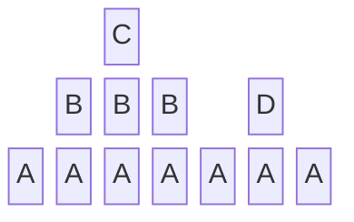

# The Stack
The stack refers to the order of operations when concurrent processes are initiated.
The newest operation is added to the stack's top and is only removed once completed.
It often needs to be considered when calling functions from other functions.
```python
def a():
    print('a_begin'); b(); d(); print('a_end')

def b():
    print('b_begin'); c(); print('b_end')

def c():
    print('c_begin'); print('c_end')

def d():
    print('d_begin'); print('d_end')

a()
```
```
a_begin
b_begin
c_begin
c_end
b_end
d_begin
d_end
a_end
```

This stack can be represented diagramatically as: 

#### [Back](README.md)
