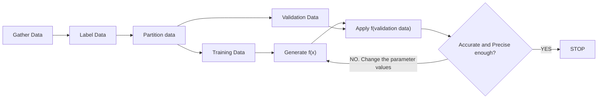
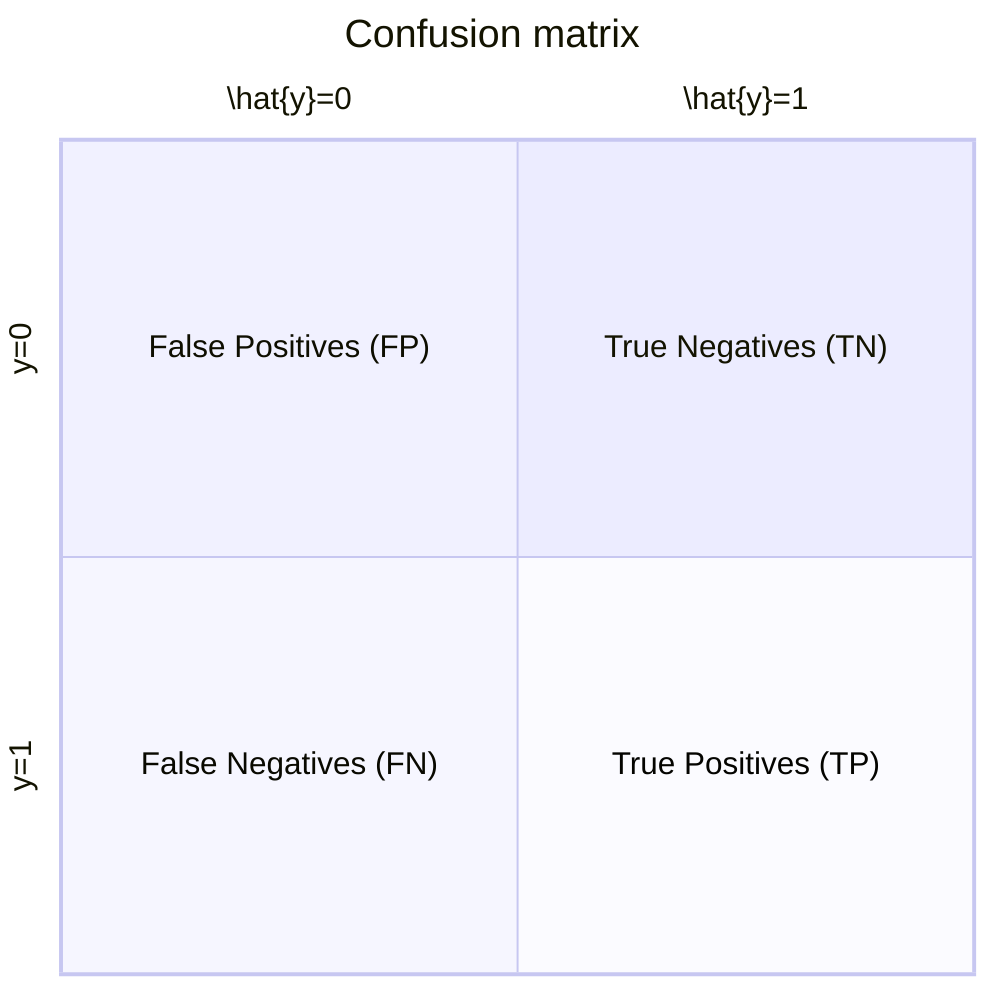
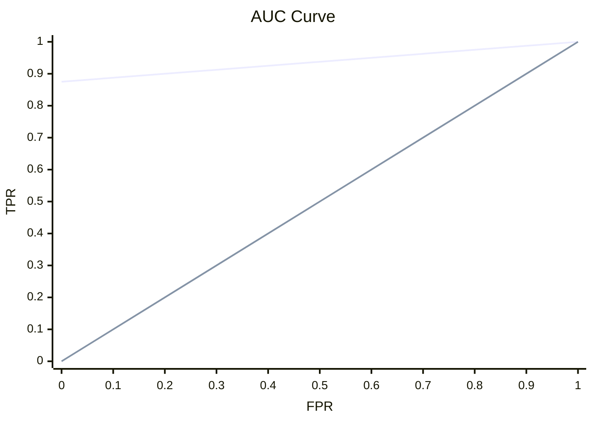

# Machine Learning (ML)
Machine Learning is a sub-discipline of Artificial Intelligence.
It creates predictive models for systems based on previous data relating to those systems.
To do this, ML creates a _function_ that accurately represents the transformation of input data into output data.

## Training
The form of the function is defined via _training_.
Training data includes inputs for the system and may include the associated outputs if they are known. 
This is analogous to the independent (input=x) and dependemutuallyt=y) variable relationship.
An algorithm is applied to the training data to develop the function (i.e. y = f(x)).
The function can then be used to predict outputs for given inputs. 
Predicted outputs are denoted as $\hat{y}$.
If the function fails to make accurate predictions, the training process can be repeated with new algorithms and/or parameters. 

As such, most ML processes follow this loop:
1. Gather training data for a system.
2. Apply an algorithm to generate a representative function for the system.
3. Use the function to predict future behaviour of the system.
4. If the function produces insufficiently accurate results, repeat the above steps using a new algorithm and/or parameters. 

There are three broad branches of Machine Learning.

- Supervised Learning: Uses training data to build a mathematical model of the system.
- Unsupervised Learning: No training data is provided. Correlations are searched for within the dataset.
- Reinforcement Learning: Uses a reward-punishment system to reinforce successful behaviour.

## Subdivisions of Machine Learning
There are numerous subdivisions of ML. Examples include:
- Supervised Learning: The training data includes the output data (is _labelled_). Subdivisions include:
  - Regression: The data is numeric or can be easily quantified.
  - Classification: The output must be categorised. Subdivisions include:
    - Binary classifications: The output must be assigned to one of two mutually exclusive classes (e.g. True/False, Yes/No).
    - Multiclass classification: The output must be assigned to one of several mutually exclusive classes (e.g. Species classification).
    - Multilabel classification: The output may be assigned several mutually exclusive classes (e.g. A person may have more than one hobby).
- Unsupervised Learning: The training data does not include the output data. Subdivisions include:
  - Clustering: Categorising data based on correlations between inputs.

<!--Add reinforcement learning examples-->

## Supervised Learning Methods

### Regression 
This is used when the data is already numeric or can be easily quantified (e.g. x-y curve fitting).

#### Training process:
1. Randomly remove some training data for validation.
2. Apply a training algorithm with set parameters to generate the function.
3. Run the validation data through the function.
4. Check the difference between the function's predictions and the validation data's outputs.
5. If the differences are too large, repeat the test with different parameters and algorithms until a desired level of precision is reached.



#### Evaluation metrics
- Mean Absolute Error (MAE): The average absolute difference between the output and the prediction. 
- Mean Squared Error (MSE): The average squared difference between the output and the prediction. This tends to amplify larger errors that are detected in the dataset. 
- Root Mean Squared Error (RMSE): The square root of the MSE, which renormalises the MSE to the scale of the problem at hand.  
- $R^{2}$ (Coefficient of determination): $R^{2} = 1 - \frac{\sum{(y-\hat{y})^{2}}}{\sum{(y-\bar{y})^{2}}}$, where $\bar{y}$ is the mean of the output data. $\sum{(y-\hat{y})^{2}}$ and $\sum{(y-\bar{y})^{2}}$ are referred to as the _residual_ and _total_ sum of sqaures respectively. For a perfect match, $R^{2}=1$. For a completely imperfect match, $R^{2}=0$. This metric is more likely to ignore outlier results and therefore provides a better estimate of the function's actual error.

### Binary Classification
Classification models use _probabilities_ to assign data to classes.
For binary classification, these probabilities span the range 0 to 1.
_Logistic regression_ is a means to perform binary classification. 
It works by fitting the data to a sigmoid function that spans the range 0 to 1.
Values above 0.5 are rounded to 1 and vice versa.

```mermaid
xychart
    title "Logistic Regression"
    x-axis "x" -10 --> 10
    y-axis "y" 0 --> 1
    line [0.0, 0.0, 0.0, 0.0, 0.0, 0.01, 0.02, 0.05, 0.12, 0.27, 0.5, 0.73, 0.88, 0.95, 0.98, 0.99, 1.0, 1.0, 1.0, 1.0, 1.0]
```
```python
import math
x_vals = range(-10,11)
sigmoid = [round(1/(1+math.exp(-x)),2) for x in x_vals]
print(sigmoid)
# >> [0.0, 0.0, 0.0, 0.0, 0.0, 0.01, 0.02, 0.05, 0.12, 0.27, 0.5, 0.73, 0.88, 0.95, 0.98, 0.99, 1.0, 1.0, 1.0, 1.0, 1.0]
```

Once this is done, the predicted results are compared to the actual results and a confusion matrix is generated.

Often, each quadrant is colour-coded to serve as a heat map, which speeds up analysis. The evaluation metrics can be derived from the confusion matrix:

#### Evaluation metrics
- Accuracy: $frac{TN+TP}{TN+FN+FP+TP}$. This represents the proportion of predictions that the model gets right. However, this does not interrogate the features of the dataset.
- True Positive Rate (TPR) and True Negative Rate (TNR): $TPR=\frac{TP}{TP+FN}$, $TNR=\frac{FP}{FP+TN}$. The TPR (or Recall) provides the proportion of correctly measured cases. Vice versa for the TNR.
- Precision: $\frac{TP}{TP+FP}$ The proportion of correctly predicted cases.
- F1-score: $\frac{2\times Precision\times Recall}{Precision + Recall}$. Combines the precision and TPR metrics to establish an overall metric. 
- Area Under the Curve (AUC): Plotting the TPR against the FPR provides a visual hint towards the model's validity. If the area under the curve is =1, the model is perfect. If the area is 0, the model is completely imperfect.  


### Multiclass Classification
This is similar to binary classification except there are more than two classes in which to sort the data.
There are two kinds of multiclass classification algorithms:
- One-vs-rest algorithms: Run a binary classification for each class. Select the class with the highest probability.
- Multinomial algorithms: Apply a function that generates a probability distribution across all classes.

Once the algorithm has been applied to the training data, a confusion matrix can be generated and assessed, similarly to binary classification.

## Unsupervised Learning Methods

### Clustering
This method categorises groups of data based on correlations between their inputs. A commonly used clustering algorithm is K-means clustering:
1. Vectorise the features into a Cartesian coordinate space.
2. Guess the number of clusters (K)
3. Plot each K-point randomly within the vector space. Each k point for a given configuration is known as a centroid.
4. Assign each data point to its nearest centroid.
5. Using the average distance between the assigned data points, move each centroid to the centre of its assigned cluster.
6. Reassign the data point to the newly positioned centroids.
7. Repeat steps until a set precision tolerance or maximum number of iterations is reached.

#### Evaluation metrics
- Average distance to assigned centroid.
- Average distance to other centroids.
- Maximum distance to cluster centres.
- Calculate the silhouette: The ratio of the distance between points in the same cluster and points in other clusters (ranges -1 to 1). The closer to 1, the better.

## Deep Learning
This aims to emulate human learning through _artificial neural networks_.
In the human brain, information is passed electrochemically via neurons.
In an artificial neural network, neurons are represented via functions that operate on input values and _weights_. 
Each function's ability to pass information is controlled by an _activation function_.
Neural networks are deeply nested functions (hence the term "deep" learning). They are also referred to as _deep neural networks_.
They can be used for training most ML applications. They are organised into _layers_ of functions through which training data is passed. 
Each function's weight can be adjusted to better fit the model to the correct outcomes.
To do this, a loss function evaluates the difference between the real and predicted values. 
This loss function is then fed into an _optimisation function_ that seeks to manage the weights across the neural network. 
Usually, the optimisation function is a simple _gradient descent_ algorithm that acts on the loss function.
Optimisation is carried out until a desired level of precision is reached.

GPUs are often more effective for neural network processing.

## Technobabble
_Inferencing_ involves using ML models to make predictions. 
An _epoch_ is an iteration of the optimisation function through the weights of a neural network.
A _feature_ is a training data input.
A _label_ is the known result associated with a given feature.
Training data with multiple inputs is referred to as a _vector_.

## References
- Introduction to Machine Learning Concepts - Training, https://learn.microsoft.com/en-us/training/modules/fundamentals-machine-learning/, (accessed 10 October 2025).
