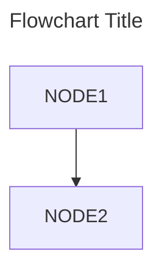
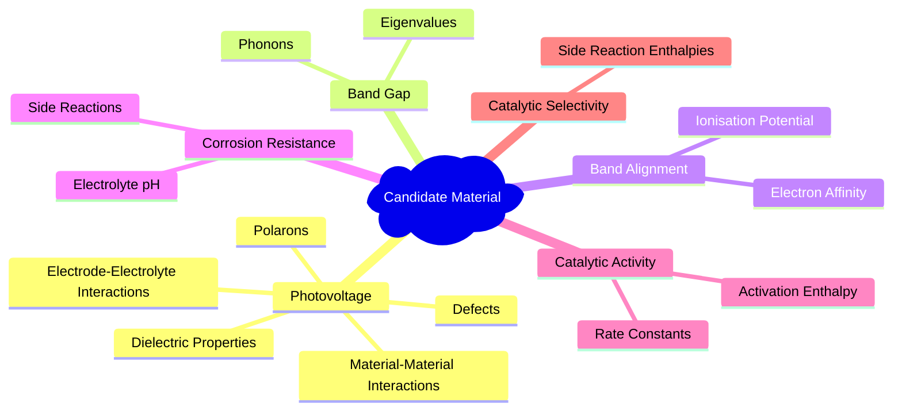

# Flowcharts
In flowcharts, features are catgorised as nodes (e.g. boxes) or egdes (e.g. arrows).
Flowchart orintations are declared using TD (top-down), TB (top-bottom), BT (Bottom-top), RL (Right-Left), LR (Left-Right)

---

---

## Box Types

## Mind Maps

