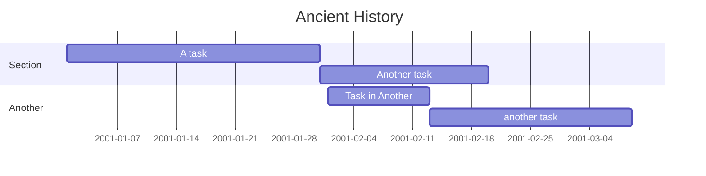

# Timeline
Key points in history worth memorising. Reference is the book 1001 days that changed the world.

## History of the World


# Ottoman Empire

# Roman Empire

# British Empire
```mermaid
title British Empire
section = British Empire
```
