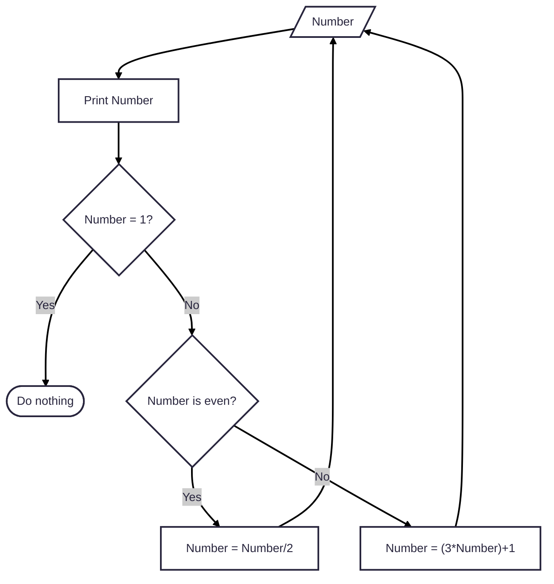

# The Collatz Conjecture
The Collatz Conjecture considers that for any integer that is > 1:
- if the number is even, divide it by two.
- if the number is odd, multpily it by 3 and add 1.

Continue to iterate on the output until 1 is reached.

Any number input to this sequence will, at some point, be equal to 1.

A proof for this relation is yet to be determined.

## Flowchart


## Python Code
```python
def collatz(number: int) -> int:
    ''' Collatz Sequence Generator

    Input an integer and the Collatz sequence will be printed.
    '''
    try:
        print(int(number))
        if number == 1:
            pass
        elif number % 2 == 0:
            number = number / 2
            collatz(number)
        else:
            number = (3 * number) + 1
            collatz(number)
    except ValueError:
        print('INVALID INPUT: ONLY INTEGERS ALLOWED')
```
